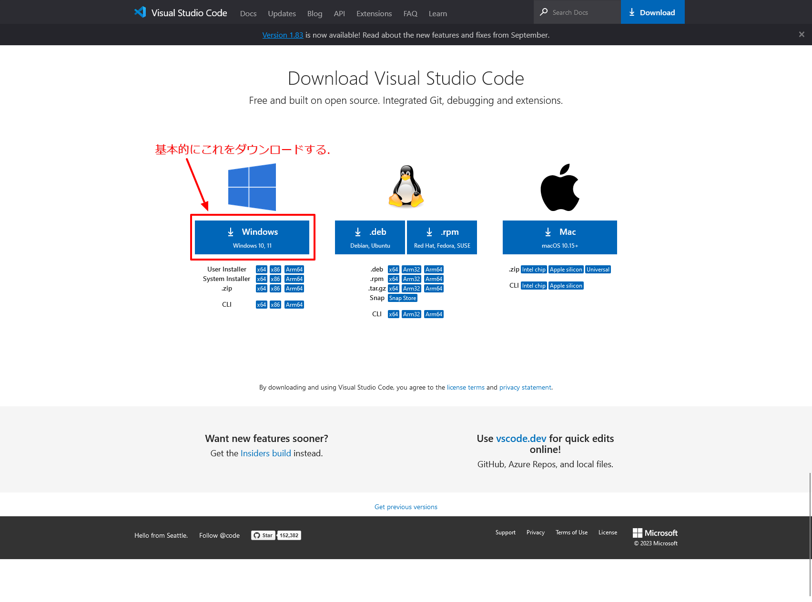
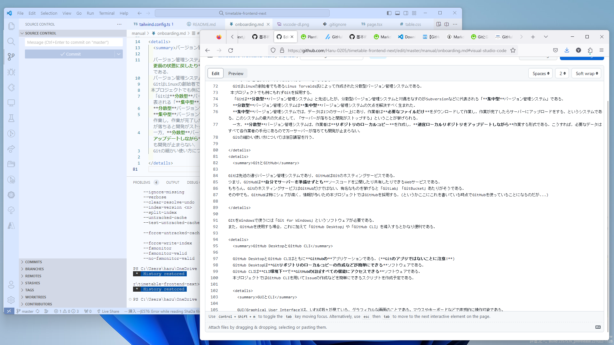
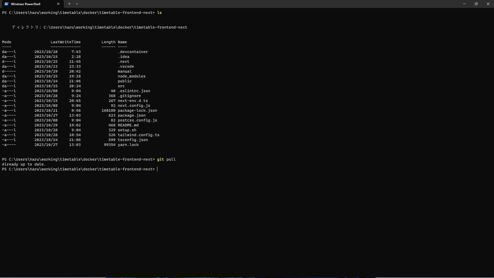

haru-0205/timetable-frontend-next

# 参加マニュアル

## マニュアルを読むにあたって(注意事項)

- このマニュアルは**Windows 11** がインストールされた PC を想定している．
  Mac や Linux,ChromeOS を使用している人は適宜読み替えること．
  なお，内容によっては折りたたんだ状態で記載することもある．
- 解説用の写真類については基本的に折りたたんである．
  必要なときは展開して確認すること．

## 必要なソフトウェアとそのインストール

本プロジェクトでは以下のツールを使用している．ゆえに，以下のソフトウェアのインストールが必要である．

> [!NOTE]
> すでにインストール済みの場合，再インストールは不要．
> (ただし，バージョンごとの差異が発生する可能性があるため，欠かさずアップデートすること．)

- [Visual Studio Code](#visual-studio-code) : コードエディター
- Git for Windows : バージョン管理ソフトウェア
- Docker Desktop : コンテナー型仮想化ソフト(後述)
- Mozilla Firefox : ブラウザー
- Windows Subsystem for Linux : Linux 環境(後述)

また，作業マニュアル等も GitHub にアップロードする予定であるため，以下のアプリケーションのインストールを推奨する．

- GitHub Mobile App (
  [Google Play](https://play.google.com/store/apps/details?id=com.github.android&pcampaignid=web_share),
  [App Store](https://apps.apple.com/jp/app/github/id1477376905))

## Visual Studio Code

### 概要

Visual Studio Code は「VSCode」と略されることが多い定番のテキストエディタ－である．  
これを制作したのは Microsoft 社であるが，オープンソースプロジェクトとして GitHub でソースコードを公開している．

### インストール

1. https://code.visualstudio.com/download から最新のビルドをダウンロードする．
2. ダウンロードしたインストーラーをダブルクリックして起動する．
3. インストーラーに沿ってインストールする．

> [!IMPORTANT]
> 手順 1 でダウンロードするのは特別な事情がない限り「Windows」とかかれたボタンをクリックすること．(画像 1)

 <details>
 <summary>画像1</summary>
   
    
 
 </details>

なお，ここで紹介した方法以外に，WinGet を使ってもインストールできる．

```powershell
winget install -id Microsoft.VisualStudioCode
```

## Git for Windows

### 概要

Git は，現在(おそらく)最もシェアの高いバージョン管理システムである．

<details>
  <summary>バージョン管理システムについて</summary>
  
  バージョン管理システムは，**「いつ」「誰が」「どのファイルを」「どのように」変更したのかを記録**し， **必要に応じて変更前の状態に戻したり**，**1つのプロジェクトから分岐して別々に作業したり**,**それらを統合したりできる便利なシステム**である．  
  バージョン管理システムの筆頭はやはり「Git」であろう．  
  GitはLinuxの創始者でもあるLinus Torvalds氏によって作成された分散型バージョン管理システムである．  
 本プロジェクトでも例にもれずGitを採用する．  
  「Gitは**分散型**バージョン管理システム」と先述したが，分散型バージョン管理システムと対偶をなすのがSubversionなどに代表される「**集中型**バージョン管理システム」である．  
  **分散型**バージョン管理システムは**集中型**バージョン管理システムの欠点を解決すべく生まれた．  
  **集中型**バージョン管理システムでは，データは1つのサーバー上にあり，作業者は**必要なファイルだけ**をダウンロードして作業し，作業が完了したらサーバーにアップロードをする，というシステムである．このシステムの最大の欠点として，「サーバーが落ちると開発がストップする」ということが挙げられる．  
  一方，**分散型**バージョン管理システムは，作業者は**リポジトリのローカルコピー**を作成し，**適宜ローカルリポジトリをアップデートしながら**作業する形式である．こうすれば，必要なデータはすべて各作業者の手元にあるので万一サーバーが落ちても開発が止まらない．  
  Gitの細かい使い方については後日講習を行う．
  
</details>
<details>
  <summary>GitとGitHub</summary>

Git は先述の通りバージョン管理システムであり，GitHub は Git のホスティングサービスである．  
つまり，GitHub は**自分でサーバーを準備せずとも**ソースコードを公開したり共有したりできる Web サービスである．  
もちろん，Git のホスティングサービスは GitHub だけではない．有名なものを挙げると「GitLab」「GitBucket」あたりがそうである．  
その中でも，GitHub は特にシェアが高く，情報が多いため本プロジェクトでは GitHub を採用する．(というかここにこれを書いている時点で GitHub を使っていることになるのだが...)

</details>

GIt を Windows で使うには「Git for Windows」というソフトウェアが必要である．  
また，GitHub を使用する場合，これに加えて「GitHub Desktop」や「GitHub CLI」を導入するとかなり便利である．

<details>
  <summary>GitHub DesktopとGitHub CLI</summary>

GitHub Desktop と GitHub CLI はともに**GitHub の**アプリケーションである．(**Git のアプリではないことに注意!**)  
 GitHub Desktop は**Git リポジトリのローカルコピーの作成などが簡単にできる**ソフトウェアである．
GitHub CLI は**CLI 環境下**で**GitHub のほぼすべての機能にアクセスできる**ソフトウェアである．  
 本プロジェクトでは GitHub CLI を用いて Issue の作成などを簡単にできるスクリプトを作成予定である．

</details>
<details>
  <summary>GUIとCLI</summary>

  GUI(Graphical User Interface)は，いわば我々が見ている，グラフィカルな画面のことである．マウスやキーボードなどで直感的に操作可能である．

  
  CLI(Command Line Interface)は，(イメージとしては)真っ黒の画面にただ文字だけが表示されている画面である．基本的にキーボードのみで操作する．

  

  なお，CLIは「別名」が多数存在する．(CUI:Command User Interface/Caractor-based User Interface 等)

</details>
